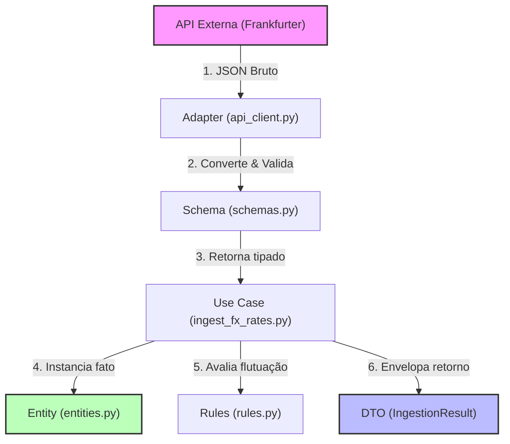
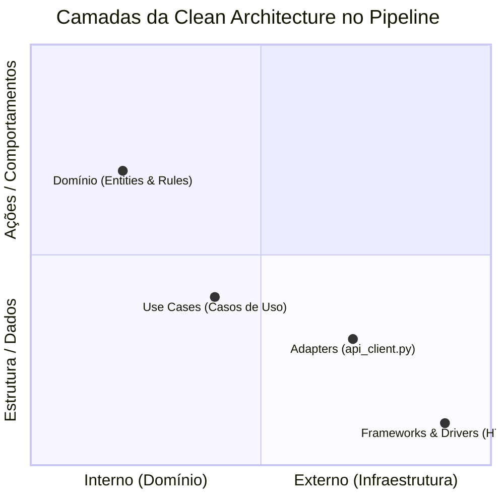
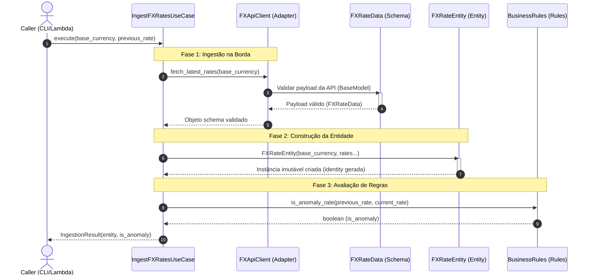

# Guia de Arquitetura: FX Ingestion Pipeline

Este documento detalha o funcionamento arquitetural do pipeline de ingestão de taxas de câmbio, explicando o fluxo de dados em execução (runtime), a relação das camadas com a **Clean Architecture**, a hierarquia de dependências para criação dos arquivos, o processo de comunicação interna e o funcionamento dos testes com Mocks.

---

## 1. Sentido do Fluxo de Dados (Runtime)

Durante a execução da funcionalidade, os dados fluem da extrema direita (borda de infraestrutura) em direção ao núcleo do negócio, sendo purificados em cada etapa até gerarem um resultado estruturado de saída (DTO).



1. **JSON Bruto:** A API externa envia dados não confiáveis pela rede.
2. **Validação na Borda:** O Adaptador usa o Schema para barrar dados corrompidos.
3. **Mapeamento:** O Caso de Uso converte o Schema validado em uma Entidade de Domínio imutável.
4. **Regras Puras:** O Caso de Uso consulta as regras de negócio para identificar anomalias.
5. **Entrega de Saída:** O DTO é devolvido para a camada chamadora (ex: CLI, Lambda, Controller).

---

## 2. Comunicação com a Clean Architecture

A estrutura de arquivos do projeto está organizada respeitando estritamente a **Regra de Dependência (Dependency Rule)**: as camadas internas nunca conhecem nada das camadas externas.



### O Fluxo das Importações (Código)
As importações (`import`) no Python mostram para onde a dependência aponta:

* **Domínio (`entities.py` e `rules.py`)**: Não importam nada de fora. São 100% independentes.
* **Adapters (`api_client.py`)**: Conhece o Domínio apenas para usar o `schemas.py`.
* **Use Cases (`ingest_fx_rates.py`)**: Importa os `Adapters` (para obter dados) e o `Domínio` (para orquestrar a lógica).

---

## 3. Estruturas de Dados e Tipos de Classes

No pipeline, diferenciamos os dados em três tipos fundamentais de classes, cada um com sua responsabilidade e decorators específicos:

### A. FXRateData (Pydantic Schema) -> Validação de Entrada
* **Arquivo:** [schemas.py](file:///c:/Users/isabe/Documents/projetos/fx-ingestion-pipeline/src/domain/schemas.py)
* **Tipo:** Classe derivada de `pydantic.BaseModel`.
* **Responsabilidade:** Funciona como o **Data Contract** da borda da aplicação. Garante que os tipos que entram (vindo da API ou do Evento) estão no formato correto (ex: strings com 3 caracteres para moedas, datas ISO).
* **Decorators:** Usa `@field_validator` para validações personalizadas rápidas (ex: garantir taxas estritamente positivas).

### B. FXRateEntity (Entidade de Domínio) -> Domínio Imutável
* **Arquivo:** [entities.py](file:///c:/Users/isabe/Documents/projetos/fx-ingestion-pipeline/src/domain/entities.py)
* **Tipo:** Dataclass do Python.
* **Responsabilidade:** Representa o objeto de negócio de câmbio puro. Ela é completamente alheia a infraestrutura, S3, APIs externas ou banco de dados. 
* **Decorators:** `@dataclass(frozen=True)` (garante a imutabilidade do dado dentro da aplicação).

### C. IngestionResult (DTO / Result Object) -> Resultado da Operação
* **Arquivo:** [entities.py](file:///c:/Users/isabe/Documents/projetos/fx-ingestion-pipeline/src/domain/entities.py)
* **Tipo:** Dataclass do Python.
* **Responsabilidade:** Transmite o resultado técnico da execução da pipeline (onde o arquivo foi salvo no S3, se houve anomalia detectada pelo Z-score, se foi para quarentena). É o envelope de saída do Caso de Uso.
* **Decorators:** `@dataclass(frozen=True)`.

### 💡 O que é um DTO (Data Transfer Object)?
Um **DTO (Objeto de Transferência de Dados)** é um padrão de design de software cujo único objetivo é transportar dados entre diferentes processos ou camadas do sistema. 

**Características de um DTO no nosso projeto:**
1. **Sem Lógica de Negócio:** Ele não possui nenhuma regra de validação complexa ou comportamento. É apenas um container de dados (atributos estruturados).
2. **Desacoplamento de Camadas:** Ele permite que a camada de Caso de Uso (`IngestFXRatesUseCase`) empacote dados técnicos (ex: caminho no S3, flags de anomalia) e envie tudo de uma vez para o Handler da Lambda, sem expor métodos internos ou forçar o Handler a gerenciar múltiplas variáveis de retorno.
3. **Agrupamento de Chamadas:** Em vez de retornar uma tupla com múltiplos valores do tipo `return entity, is_anomaly, s3_path`, retornamos um único DTO imutável estruturado. Isso deixa a assinatura dos métodos limpa e facilita a manutenção do código.

---

## 4. O Fluxo de Entrada: AWS Lambda Handler

O ponto de entrada sem servidor na AWS é o arquivo [lambda_handler.py](file:///c:/Users/isabe/Documents/projetos/fx-ingestion-pipeline/src/adapters/lambda_handler.py). Ele atua como um adaptador de infraestrutura:

1. **Recebe o Evento:** A AWS invoca a função com o payload bruto `event`.
2. **Injeta Dependências:** Instancia o `FXApiClient`, o `S3Repository` e o caso de uso `IngestFXRatesUseCase`.
3. **Chama a Lógica de Negócio:** Passa os parâmetros extraídos do evento para a execução do caso de uso.
4. **Responde Formatado:** Transforma o `IngestionResult` em uma resposta HTTP com status code `200` adequada para a AWS.

```text
[AWS EventBridge/Trigger] 
         │
         ▼
 1. lambda_handler.py ──► [Injeção de dependências: api_client, s3_repo]
         │
         ▼
 2. IngestFXRatesUseCase ──► [Executa download, valida contrato, checa anomalias]
         │
         ▼
 3. IngestionResult ──► [Retorna metadados de execução para o handler]
         │
         ▼
 [Retorno HTTP 200 / JSON]
```

---

## 5. Como Funcionam os Testes unitários com Mocks

Nos testes unitários (como o [test_lambda_handler.py](file:///c:/Users/isabe/Documents/projetos/fx-ingestion-pipeline/tests/unit/test_lambda_handler.py)), nós validamos o comportamento da aplicação isolando-a de qualquer conexão externa real. 

### Uso de `@patch` e `MagicMock`
* **Isolamento de Rede e S3:** Ao invés do teste bater na API de câmbio real ou tentar salvar um arquivo no S3 real (o que causaria lentidão e custos desnecessários), nós usamos o decorator `@patch` do Python.
* **Dublês de Teste:** O `@patch` substitui temporariamente as chamadas de classe (`S3Repository`, `FXApiClient`) por objetos `MagicMock`.
* **Configuração de Respostas:** Nós programamos o mock para retornar um valor imutável pré-definido quando for acionado:
  ```python
  mock_use_case_inst.execute.return_value = IngestionResult(entity=mock_entity, is_anomaly=False)
  ```
* **Asserções de Comportamento:** No final, além de checar a saída do handler, usamos comandos como `assert_called_once_with` para garantir que o fluxo de negócios foi acionado com os dados corretos que vieram do evento.

---

## 6. Comunicação de Processos (Sequence Diagram)

O diagrama a seguir descreve a sequência de chamadas de métodos e processos que ocorrem quando o Caso de Uso de ingestão é executado:


