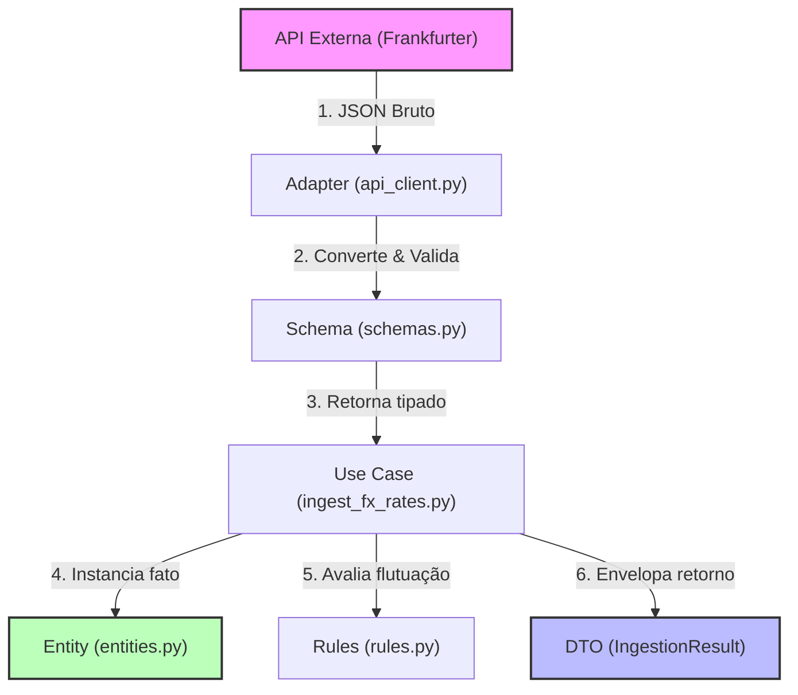
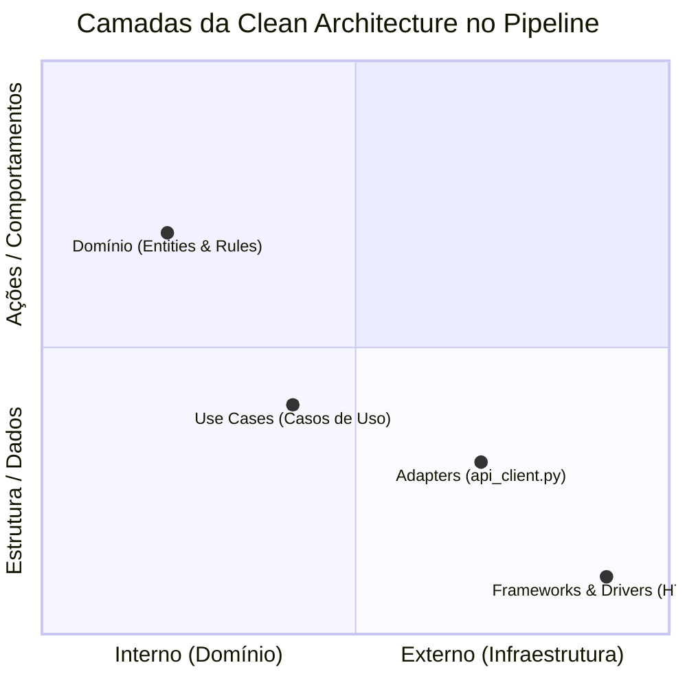
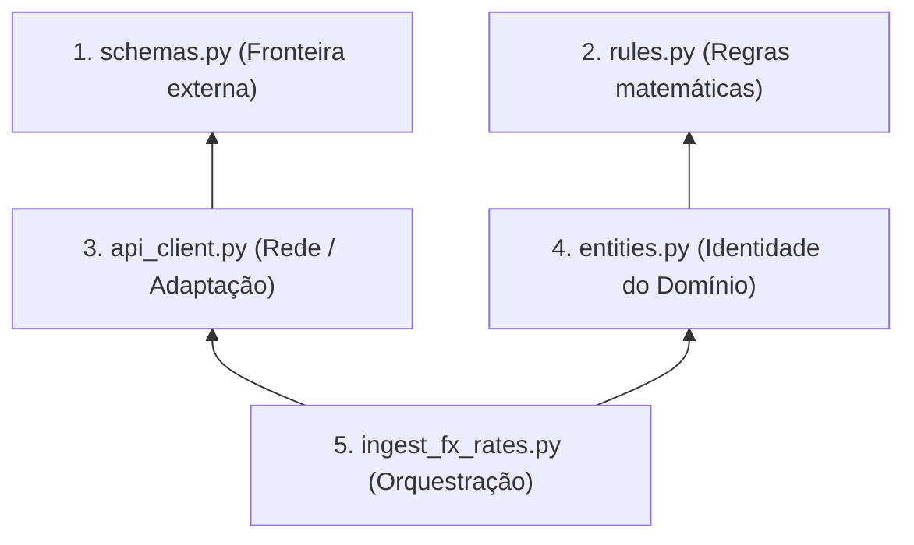
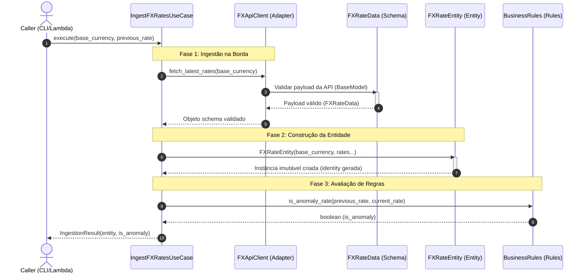

# Guia de Arquitetura: FX Ingestion Pipeline

Este documento detalha o funcionamento arquitetural do pipeline de ingestão de taxas de câmbio, explicando o fluxo de dados em execução (runtime), a relação das camadas com a **Clean Architecture**, a hierarquia de dependências para criação dos arquivos e o processo de comunicação interna.

---

## 1. Sentido do Fluxo de Dados (Runtime)

Durante a execução da funcionalidade, os dados fluem da extrema direita (borda de infraestrutura) em direção ao núcleo do negócio, sendo purificados em cada etapa até gerarem um resultado estruturado de saída (DTO).

1. **JSON Bruto:** A API externa envia dados não confiáveis pela rede.
2. **Validação na Borda:** O Adaptador usa o Schema para barrar dados corrompidos.
3. **Mapeamento:** O Caso de Uso converte o Schema validado em uma Entidade de Domínio imutável.
4. **Regras Puras:** O Caso de Uso consulta as regras de negócio para identificar anomalias.
5. **Entrega de Saída:** O DTO é devolvido para a camada chamadora (ex: CLI, Lambda, Controller).

---

## 2. Comunicação com a Clean Architecture

A estrutura de arquivos do projeto está organizada respeitando estritamente a **Regra de Dependência (Dependency Rule)**: as camadas internas nunca conhecem nada das camadas externas.

### O Fluxo das Importações (Código)
As importações (`import`) no Python mostram para onde a dependência aponta:

* **Domínio (`entities.py` e `rules.py`)**: Não importam nada de fora. São 100% independentes.
* **Adapters (`api_client.py`)**: Conhece o Domínio apenas para usar o `schemas.py`.
* **Use Cases (`ingest_fx_rates.py`)**: Importa os `Adapters` (para obter dados) e o `Domínio` (para orquestrar a lógica).

---

## 3. Lógica de Criação de Arquivos (Bottom-up)

Para desenvolver sem gerar "importações fantasmas" (importar algo que ainda não foi escrito) e permitir a testabilidade imediata de cada parte, a ordem ideal de criação dos arquivos segue a hierarquia de dependência estática abaixo:

* **Fase 1 (Bases):** Criamos as definições estruturais (`schemas.py`) e regras utilitárias independentes (`rules.py`).
* **Fase 2 (Ferramentas):** Criamos os adaptadores (`adapters`) que traduzem a rede para os nossos esquemas, e as entidades (`entities`) que utilizam as regras de validação.
* **Fase 3 (Negócio):** Criamos o Caso de Uso (`use_cases`) que amarra todas as pontas já testadas e funcionais.

---

## 4. Comunicação de Processos (Sequence Diagram)

O diagrama a seguir descreve a sequência de chamadas de métodos e processos que ocorrem quando o Caso de Uso de ingestão é executado:

