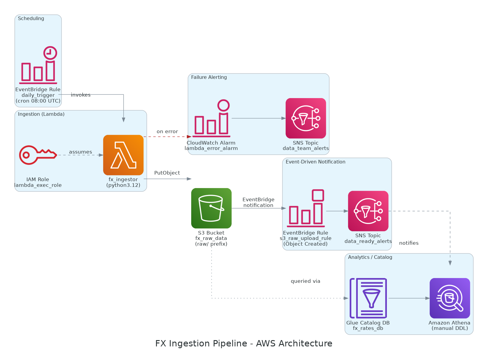

# AWS Architecture Diagram Guide — FX Ingestion Pipeline

Automatically mapped from `infra/terraform/*.tf` (main.tf, storage.tf, locals.tf, variables.tf, output.tf).

## Components & Data Flow

1. **EventBridge Rule `daily_trigger`**: Invokes the Lambda function daily on a cron schedule (`08:00 AM UTC`, configured via `var.cron_schedule`).
2. **Lambda `fx_ingestor`** (`python3.12`): Assumes the **IAM Role `lambda_exec_role`**, fetches foreign exchange rates from the external financial API, and persists the raw payload into S3 (`s3:PutObject`).
3. **S3 Bucket `fx_raw_data`**: Stores the raw JSON payloads under the partitioned folder prefix `raw/`. Native EventBridge notifications are enabled on the bucket (`aws_s3_bucket_notification`).
4. **Lambda Failures**: Trigger the **CloudWatch Alarm `lambda_error_alarm`** (monitoring metric `Errors >= 1` in a 5-minute window), which publishes to the **SNS Topic `data_team_alerts`** to notify the operations/engineering team.
5. **Object Created in `raw/`**: Triggers the **EventBridge Rule `s3_raw_upload_rule`**, which publishes a message to the **SNS Topic `data_ready_alerts`**, notifying downstream systems that the day's ingestion has finished.
6. **Glue Catalog Database `fx_rates_db`**: Holds metadata schemas queryable by **Amazon Athena** (DDL tables are manually managed, see `queries/athena_queries.sql`) to run analytics over S3 raw data.
7. **Asynchronous Lambda Retries**: Configured to automatically retry failed asynchronous executions up to 2 times (`aws_lambda_function_event_invoke_config`).

---

## 📣 Messaging Channels Breakdown (SNS)

The pipeline utilizes two distinct SNS topics with different purposes and *As-Is* integration states:

### 1. `fx-ingestion-alerts-topic-dev` (`data_team_alerts`)
* **Purpose (Human Notification):** Operational alerting channel. Designed to alert the engineering/operations team (humans) in case of persistent Lambda execution failures.
* **Current State (As-Is):**
  * The CloudWatch alarm is active and automatically publishes errors to this topic.
  * The email subscription (*Subscription*) is securely provisioned via Terraform using the `alert_email` variable (injected at runtime via GitHub Secrets).
  * **Manual action required:** The recipient of the email must click the **"Confirm subscription"** link sent by AWS in the confirmation email to start receiving alarm alerts.

### 2. `fx-ingestion-data-ready-topic-dev` (`data_ready_alerts`)
* **Purpose (System-to-System Integration - Machine-to-Machine):** Reactive event-driven channel. Designed to notify downstream pipelines, processing scripts, or analytical databases that the new daily FX rates are available in the S3 raw partition.
* **Current State (As-Is):**
  * The topic and the EventBridge rule are fully deployed, listening to raw file uploads on S3 and publishing notifications.
  * **No subscribers (zero subscriptions):** Currently, no downstream services are subscribed to this topic. It is ready to be linked to consuming targets such as SQS queues (processing buffers), AWS Step Functions (ETL orchestrators), or other transform Lambda functions.

---

## Generated Files

| File | Usage |
|---|---|
| `diagrams/fx_ingestion_architecture.png` | Main PNG image for documentation, Pull Requests, and Slack channels. |

---

## How to Regenerate

This diagram is generated **locally and on-demand**—there is no automated pipeline or CI/CD runner tracking its changes. Only the final output artifact (`png`) is kept in version control.

Whenever you modify the Terraform files in `infra/terraform/`, ask to regenerate the diagram from the updated `.tf` configuration. Under the hood, this uses a Python script leveraging the [`diagrams`](https://diagrams.mingrammer.com/) library (requires Graphviz installed on the local host) to build the visual flow and output the final PNG file.
