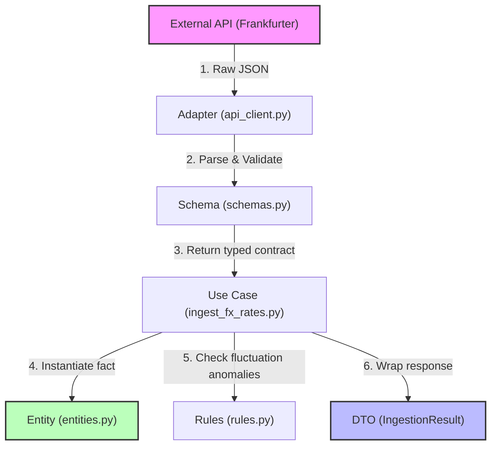
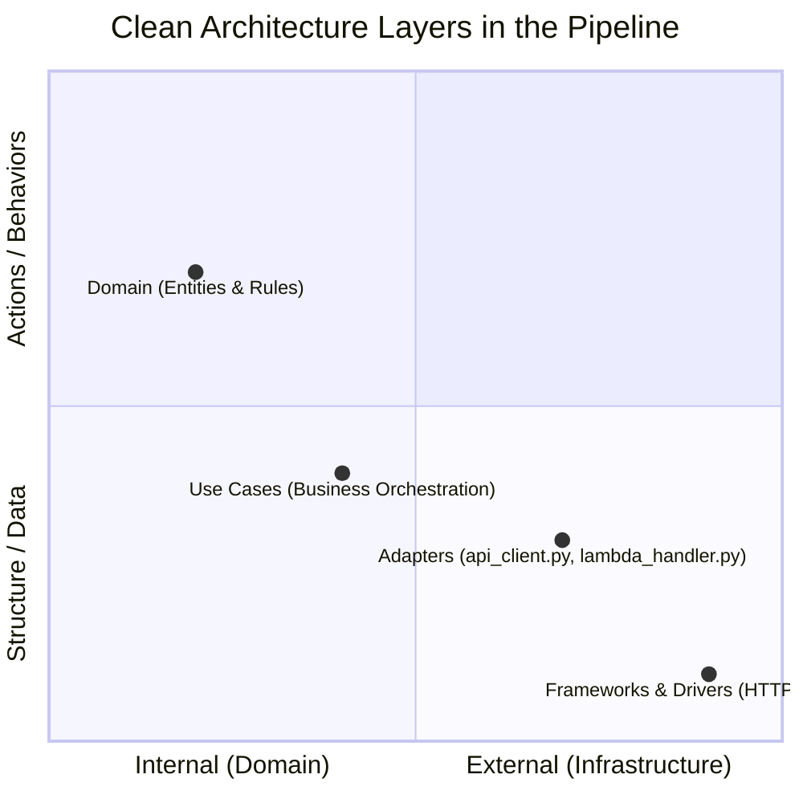
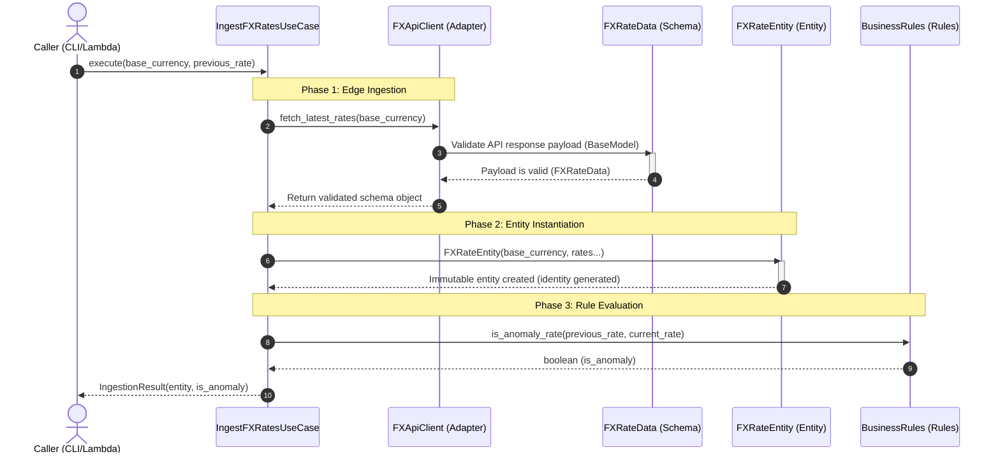

# Architecture Guide: FX Ingestion Pipeline

This document details the architectural design of the exchange rate ingestion pipeline, explaining the runtime data flow, how code layers map to **Clean Architecture**, the dependency hierarchy of files, the internal process communication, and testing with Mocks.

---

## 1. Data Flow Direction (Runtime)

During execution, data flows from the far right (infrastructure edge) towards the core of the business, being purified at each stage until generating a structured Output DTO.



1. **Raw JSON:** The external API sends untrusted data across the network.
2. **Edge Validation:** The Adapter uses the Schema validation contract to block corrupt or malformed payloads at the door.
3. **Mapping:** The Use Case maps the validated Schema into an immutable Domain Entity.
4. **Pure Domain Rules:** The Use Case invokes pure business rules to evaluate standard deviations or anomalies (Z-score checks).
5. **Output Delivery:** The final Use Case execution metadata is wrapped into an immutable DTO and returned to the caller layer (e.g. CLI, AWS Lambda Handler, API Controller).

---

## 2. Decoupling & Clean Architecture Layers

The file structure of the project strictly respects the **Dependency Rule**: inner layers never know anything about outer layers.



### Import Flows (Code Coupling)
Python `import` statements demonstrate where a dependency points:

* **Domain (`entities.py` and `rules.py`)**: Do not import anything from the outside. They are 100% self-contained and pure.
* **Adapters (`api_client.py`)**: Only know about the Domain layer to leverage `schemas.py` for data contraction.
* **Use Cases (`ingest_fx_rates.py`)**: Import the `Adapters` interface (interfaces/repositories to write/read data) and the `Domain` models to orchestrate logic.

---

## 3. Data Structures & Class Stereotypes

In this pipeline, data structures are split into three fundamental types, each carrying its own responsibility and custom decorators:

### A. FXRateData (Pydantic Schema) -> Input Validation
* **File:** [schemas.py](../src/domain/schemas.py)
* **Type:** Class derived from `pydantic.BaseModel`.
* **Responsibility:** Acts as the **Data Contract** at the edge of the application. It guarantees that inputs entering the system (from the API or manual events) conform to the required types (e.g., ISO currency codes, valid date formats).
* **Decorators:** Uses `@field_validator` for customized field validation rules (e.g. enforcing strictly positive rate percentages).

### B. FXRateEntity (Domain Entity) -> Immutable Domain Fact
* **File:** [entities.py](../src/domain/entities.py)
* **Type:** Python dataclass.
* **Responsibility:** Represents the pure business exchange rate entity. It is entirely decoupled from databases, S3, external APIs, and infrastructure engines.
* **Decorators:** `@dataclass(frozen=True)` (guarantees data immutability throughout the application execution lifecycle).

### C. IngestionResult (DTO / Result Object) -> Output envelope
* **File:** [entities.py](../src/domain/entities.py)
* **Type:** Python dataclass.
* **Responsibility:** Transmits the technical results of the ingestion pipeline (S3 target key, anomaly status, quarantine triggers). It is the use case's output payload envelope.
* **Decorators:** `@dataclass(frozen=True)`.

### 💡 What is a DTO (Data Transfer Object)?
A **DTO** is a software design pattern whose sole purpose is to transport structured data across process boundaries or software layers.

**Key Features of DTOs in this repository:**
1. **No Business Logic:** They hold zero business logic, constraints validation, or behavior. They are pure data containers.
2. **Layer Decoupling:** Allows the `IngestFXRatesUseCase` layer to package technical execution stats (S3 path, quarantine logs) and return them to the Lambda Handler without forcing the Handler to manage multiple independent output variables.
3. **Structured Returns:** Instead of returning ambiguous tuples like `return entity, is_anomaly, s3_path`, the use case returns a typed, immutable DTO. This keeps method signatures clean and easy to test.

---

## 4. Ingestion Entry Point: AWS Lambda Handler

The serverless entry point in AWS is the [lambda_handler.py](../src/adapters/lambda_handler.py) file. It acts as an infrastructure adapter:

1. **Extracts Event Parameters:** AWS invokes the function passing a raw `event` dict.
2. **Injects Dependencies:** Instantiates the `FXApiClient` and `S3Repository` and injects them into the `IngestFXRatesUseCase`.
3. **Executes Core Case:** Passes parameters to the Use Case orchestrator.
4. **Formats Response:** Packages the output `IngestionResult` DTO into an API Gateway/Lambda structured response with status code `200`.

```text
[AWS EventBridge/Trigger] 
         │
         ▼
 1. lambda_handler.py ──► [Inject dependencies: api_client, s3_repo]
         │
         ▼
 2. IngestFXRatesUseCase ──► [Download payload, validate schema, check anomalies]
         │
         ▼
 3. IngestionResult ──► [Return execution metadata back to handler]
         │
         ▼
 [HTTP 200 / JSON Payload Response]
```

---

## 5. Mock-Based Unit Testing

In unit tests (such as [test_lambda_handler.py](../tests/unit/test_lambda_handler.py)), we validate application behaviors in complete isolation from real external networks.

### Use of `@patch` and `MagicMock`
* **Network & S3 Isolation:** Instead of sending HTTP requests to the real Frankfurter API or uploading files to real S3 buckets (which would be slow, unreliable, and cost-inefficient), we use Python's `@patch` decorator.
* **Test Doubles:** `@patch` replaces class dependencies (`S3Repository`, `FXApiClient`) with `MagicMock` objects.
* **Programmed Responses:** We configure mock return values (e.g. valid test payloads) to assert code outputs and error handling behaviors reliably.

---

## 6. Sequence Diagram

The following sequence diagram describes the method calls and internal processing that occur when the Ingest FX Rates Use Case executes:



---

## 7. Resiliency & Timeout Handling

If execution exceeds the time limits defined in infrastructure code (the timeout set in Terraform for the AWS Lambda function), ecosystem recovery actions depend on the invocation type and the resiliency configurations.

### ⚡ A. What Happens at Runtime?
* **Forced Termination (SIGKILL):** AWS terminates the Python process immediately. The Lambda code cannot execute standard `try/except` cleanup blocks or run final logging lines.
* **CloudWatch Log Records:** No Python tracebacks are written. CloudWatch logs only record the standard AWS platform message:
  ```text
  Task timed out after 30.00 seconds.
  ```
* **Error Metrics:** The Lambda `Errors` metric increments to `1` in Amazon CloudWatch.

### 🔁 B. Infrastructure Reaction (Retries & Dead Letter Flows)
Depending on the caller trigger, the retry mechanism varies:

* **Asynchronous Invocations (EventBridge Daily Cron Trigger):**
  By default, when invocation is asynchronous, AWS Lambda automatically retries execution up to 2 times with randomized exponential backoff (configured via `aws_lambda_function_event_invoke_config`). If network latency was temporary, the retry will succeed.
* **If All Retry Attempts Fail:**
  * **CloudWatch Alarm:** The `lambda_error_alarm` (evaluating `Errors >= 1` in 5 minutes) triggers, publishing an alert to the `data_team_alerts` SNS topic to notify operations.

### 🛠️ C. Architectural Best Practices for Handling Timeouts
To prevent timeouts from causing data corruption or missing records in the Data Lake, the following practices are enforced:

1. **Python Timeout Guardrails (HTTP Timeout < Infrastructure Timeout):**
   Ensure application-level network client timeouts are lower than AWS Lambda timeout thresholds:
   ```python
   # If Lambda timeout is 30s, set HTTP API client timeout to ~10s
   response = client.get("https://api.frankfurter.app/latest", timeout=10.0)
   ```
   * **Why do this?** If the external API hangs, the HTTP client (`httpx`) throws a catchable `httpx.TimeoutException` exception. This allows the `lambda_handler` to catch the error, log a clean error record, and fail gracefully before AWS terminates the container.

2. **Idempotency Guarantees:**
   Because AWS may retry execution in case of failure or timeout, the S3 repository writes must be idempotent. The S3 repository replaces the file on the exact same date partition path (`raw/year=YYYY/month=MM/day=DD/`) instead of duplicating files or appending duplicate rows.

3. **Sufficient Sizing in Terraform:**
   Adjust the Terraform Lambda configuration to provide enough runway for slow responses and S3 transfers:
   ```hcl
   resource "aws_lambda_function" "fx_ingestor" {
     function_name = "fx-rate-ingestor-dev"
     timeout       = 30 # Seconds (generous safety margin for HTTP calls and S3 write operations)
   }
   ```
